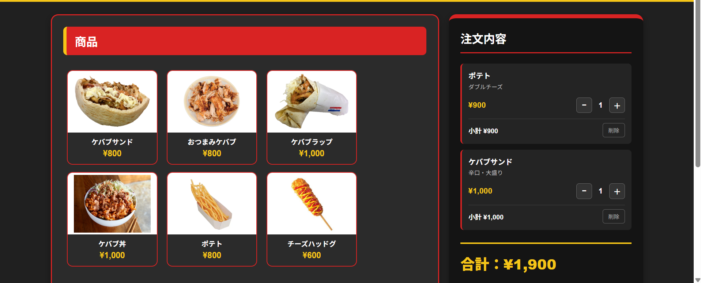

# TAYHOON KEBAB POS
ケバブ店でのレジ業務を想定して制作した、タッチパネル式のPOSシステムです。

## デモ

実際に操作できます。  
https://kuitaroujiaozi-ops.github.io/kebab-pos/

## 制作背景

実際にケバブ店でレジ業務をする中で、商品やソース、サイズなどの選択を簡単に行えるPOSシステムがあれば便利だと考え、制作しました。

プログラミング学習で身につけたHTML・CSS・JavaScriptの基礎を、実際の業務をイメージしたアプリケーションとして形にすることを目的としています。

## 主な機能

- 商品の選択
- ケバブのソース選択（甘口・中辛・辛口）
- サイズ選択（普通・大盛り）
- ポテトの味選択
- チーズハッドグのトッピング選択
- 同じ注文の数量自動集約
- 注文数量の増減
- 注文商品の削除
- 商品ごとの小計表示
- 合計金額の自動計算
- 預かり金額からお釣りを自動計算
- 金額不足時のエラー表示
- 会計履歴の表示・削除

## 使用技術

- HTML
- CSS
- JavaScript
- Git / GitHub

フレームワークやライブラリは使用せず、基本的なWeb技術を使って実装しています。

## 工夫した点

### 1. 実際のレジ操作を意識したUI

レジ業務で素早く操作できることを意識し、商品画像を大きく表示したタッチパネル風のデザインにしました。

### 2. 商品ごとに異なるオプション

ケバブではソースとサイズ、ポテトでは味、チーズハッドグではトッピングを選択できるようにし、商品ごとの注文方法の違いを再現しました。

### 3. 会計処理

預かり金額を入力すると、お釣りを自動で計算します。また、預かり金額が不足している場合は不足額を表示するようにしました。

### 4. 会計履歴

会計完了後に、会計時刻・合計金額・預かり金額・お釣りを履歴として確認できるようにしました。

## 今後改善したい点

現在はブラウザを更新すると会計履歴が消えるため、今後はLocalStorageやデータベースを利用してデータを保存できるようにしたいと考えています。

また、売上集計や商品管理などの機能も追加し、より実際の店舗で利用できるPOSシステムに近づけたいです。

## 制作者

芝浦工業大学  
情報通信工学コース
